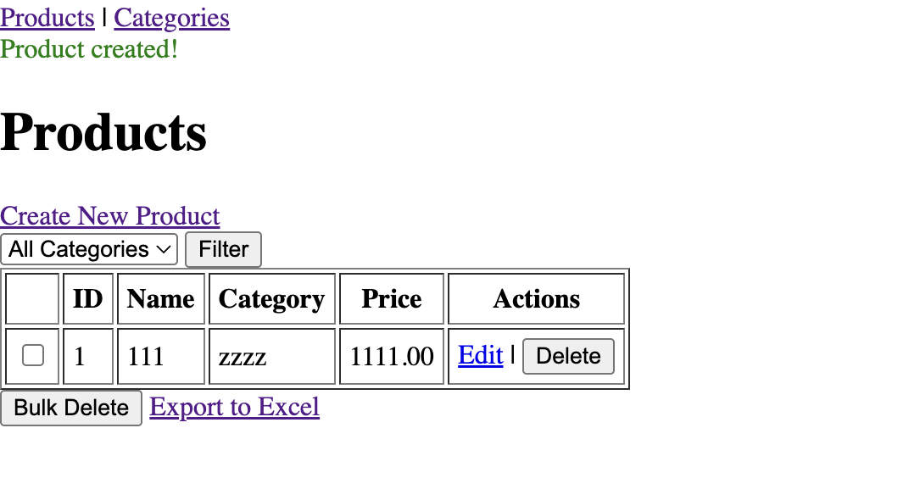

# Product

# Setup
Install laravel & create project named product
composer create-project laravel/laravel product

Run composer install
composer install

Create a DB named product in localhost mysql db

run migrations command
php artisan migrate --path=database/migrations

build the project
php artisan serve
project will default host at http://127.0.0.1:8000

# Folder Structure
```
Product/
├─ app/
│  ├─ Http/
│  │  ├─ Controllers/
│  │  │     ├─ ProductController.php
│  │  │     └─ CategoryController.php
│  │  └─ Requests/
│  │        ├─ StoreProductRequest.php
│  │        └─ UpdateProductRequest.php
├─ app/Exports/
│  └─ ProductsExport.php
├─ database/
│  ├─ migrations/
│  │     ├─ create_categories_table.php
│  │     └─ create_products_table.php
│  └─ seeders/
│        └─ CategorySeeder.php
├─ resources/views/
│  ├─ layouts/
│  │     └─ app.blade.php
│  ├─ products/
│  │     ├─ index.blade.php
│  │     ├─ create.blade.php
│  │     ├─ edit.blade.php
│  │     └─ show.blade.php
│  └─ categories/
│        ├─ index.blade.php
│        ├─ create.blade.php
│        └─ edit.blade.php
├─ routes/web.php
├─ tests/Feature/ProductTest.php
└─ .env
 ```

 # run unit test command
 ./vendor/phpunit/phpunit/phpunit tests/Feature/ProductTest.php

 # project interface
